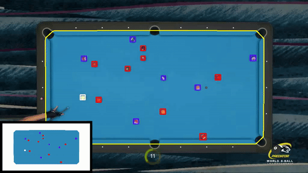

# 8BallGameAnalyzer


## Description
8BallGameAnalyzer is a tool to analyze 8-ball pool games, providing insights into strategies and statistics to improve gameplay.

## Video Demo


## Features
- Track the trajectory (BETA version)
- Analyze ball position and patterns
- Provide strategic suggestions based on game state

## Installation

### Prerequisites
- [CMake](https://cmake.org/download/)
- [OpenCV](https://opencv.org/releases/)

### Build Instructions

1. Clone the repository
    ```bash
    git clone https://github.com/Alessio240593/8BallGameAnalyzer.git
    ```

2. Navigate to the project directory
    ```bash
    cd 8BallGameAnalyzer
    ```

3. Create a build directory and navigate into it
    ```bash
    mkdir build
    cd build
    ```

4. Configure the project with CMake, specifying the path to your OpenCV installation if necessary
    ```bash
    cmake ..
    ```

5. Build the project
    ```bash
    make
    ```

## Usage
Command line usage:
```cpp
    #include <iostream>
    #include <cstdlib>
    #include <fstream>
    #include "billiardAnalyzer.hpp"
    
    int main(int argc, char** argv)
    {
        try {
            billiardAnalyzer::EightBallPoolGame::analyzingEightBallPoolGame(argc, argv);
        } catch (const std::invalid_argument & e) {
            std::cerr << e.what() << std::endl;
            exit(EXIT_FAILURE);
        } catch (const std::exception& e) {
            std::cerr << e.what() << std::endl;
            exit(EXIT_FAILURE);
        }
    
        std::exit(EXIT_SUCCESS);
    }
  ```
  ```bash
    ./main -path path/to/image_or_video -showTable true/false -showBalls true/false -showSegmentation true/false -showMinimap true/false
  ```

Usage in the cpp program:
  ```cpp
    #include <iostream>
    #include <cstdlib>
    #include <fstream>
    #include "billiardAnalyzer.hpp"
    
    int main(int argc, char** argv)
    {
        try {
            billiardAnalyzer::EightBallPoolGame::analyzingEightBallPoolGame("../Resources/videos/game2_clip2.mp4", true, true, false, true);
        } catch (const std::invalid_argument & e) {
            std::cerr << e.what() << std::endl;
            exit(EXIT_FAILURE);
        } catch (const std::exception& e) {
            std::cerr << e.what() << std::endl;
            exit(EXIT_FAILURE);
        }
    
        std::exit(EXIT_SUCCESS);
    }
  ```

## Contributing
If you'd like to contribute to this project, please fork the repository and create a pull request. You can also open issues for feature requests or bug reports.

## License
This project is licensed under the MIT License - see the [LICENSE](LICENSE) file for details.
